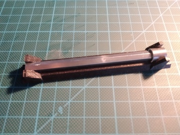

## Overview

  

## Printing

- case frames:
  - [motor-cover.stl](../models/motor/motor-cover.stl) print with `0.3mm` profile
  - [motor-lock.stl](../models/motor/motor-lock.stl) print with `0.3mm` profile
  - [motor-mount.stl](../models/motor/motor-mount.stl) print with `0.3mm` profile, with supports
  - [motor-sleave.stl](../models/motor/motor-sleave.stl) print with `0.2mm` or `0.3mm` profile, ideally with `FLEX` filament
  - [shaft-template.stl](../models/shaft-template.stl) optional, template for cutting shaft print with `0.2mm` profile
  
## Shopping list

| Item                                                                                                                                                | Price   |
| --------------------------------------------------------------------------------------------------------------------------------------------------: | :-----: |
| [DC motor - 12V](https://www.banggood.com/DC-12V-180RPM-Geared-Motor-High-Torque-Gear-Reducer-Motor-p-1068573.html)                                 | ~$14,29 |
| [PSH08-02P / PFH08-02P](https://www.ebay.com/itm/10-Pairs-6-2mm-2-Pin-Male-Female-JST-SM-Housing-Crimp-Terminal-Connector/362591186288)             | ~$5,94  |
| [Shaft coupler 6mm-10mm](https://www.ebay.com/itm/Coupling-Shaft-Motor-Coupler-4mm-5mm-6mm-7mm-8mm-10mm-45-steel-Connector-/322250560957)           | ~$2.69  |
| [M4 - wood screw](https://www.ebay.com/itm/Self-Drilling-Drywall-Wood-Screws-M4-Bugle-Head-Coarse-Thread-Zinc-Plated/273011742134) x 4              | ~$1.50  |
| [M3-6mm](https://www.ebay.com/itm/10-20-50-100x-M2-M3-M4-M5-Stainless-Steel-Hex-Bolt-Socket-Cap-Screws-Head-DIN912/173028404303) x 4                | ~$1.62  |
| SUM                                                                                                                                                 | ~$26,04 |
| Weighted SUM                                                                                                                                        | ~$26,04 |

## Assembly

- Cut the provided `Skarsta` handle to needed size, use the provided template for cutting (paint needs to be removed from the thicker part of shaft either with sandpaper or razor knife)
  

    
Motor shaft

    

      
    

  
